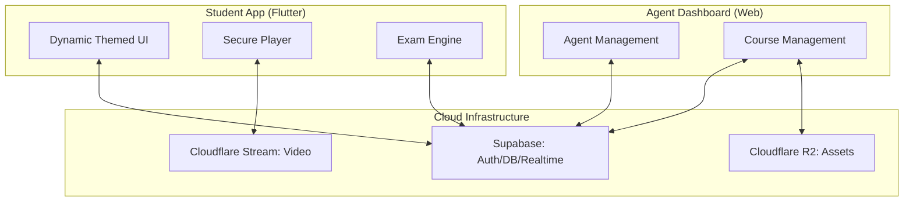
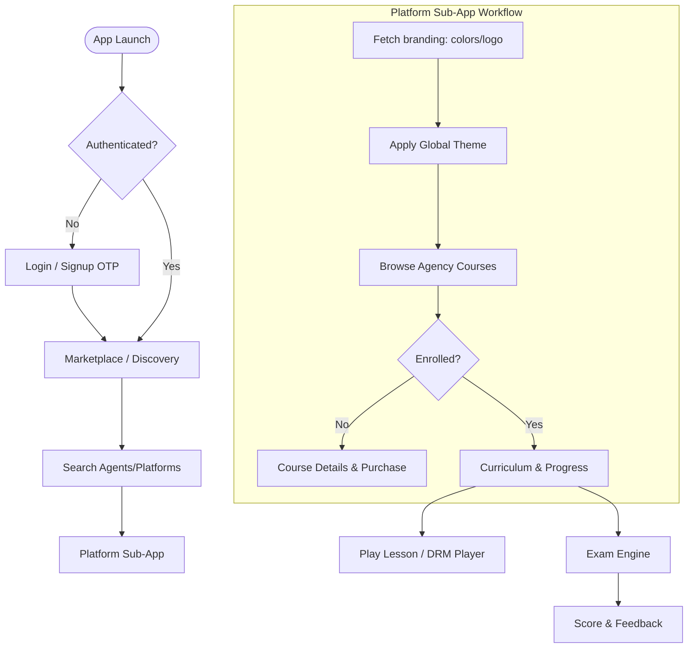

# Aurado Student Native App: Master Plan & Roadmap

The **Aurado Student Native App** is designed as a high-performance "Super App" aggregator. It provides students with a unified experience to access courses, exams, and live classes from multiple EdTech platforms (Agents) while maintaining unique branding for each.

## 🛠 Technology Stack

### Core
- **Framework**: **Flutter** (Confirmed).
- **Backend**: **Supabase** (PostgreSQL, Realtime, Storage).
- **Auth**: **Supabase Auth** (Email + **Phone Number / OTP**).
- **Edge Logic**: **Supabase Edge Functions** (HMAC Signing for offline assets).
- **Live Streaming**: **LiveKit Flutter SDK** (Connecting to Agent Dashboard's LiveKit rooms).
- **Video Player**: **Pod Player** (Unified for YouTube, Vimeo, **Bunny.net**, and R2/S3 links).
- **State Management**: **Riverpod** or **Zustand**.

### Specialized
- **Video Player Architecture**: 
  - **YouTube/Vimeo/Bunny.net**: Handled via `pod_player` with custom controllers to hide all external links/branding.
  - **R2/Direct URLs**: Streaming via `pod_player` for lessons where the DB stores a direct URL.
- **Notification System**: **Firebase Cloud Messaging (FCM)** + Supabase DB Webhooks for live classes, exams, and milestones.
- **Storage**: `flutter_secure_storage` for HMAC tokens; `path_provider` for hidden, encrypted offline video directories.

---

## 🏗 Detailed App Structure

### 1. Onboarding & Auth
- **Splash 1 — Brand Intro**: Animated entry.
- **Splash 2 — Platform Showcase**: Explaining the Super App model.
- **Splash 3 — Role Selection**: Directing user experience.
- **Auth — OTP / Email**: Supabase Auth integration.
- **OTP Verify**: Secure verification.

### 2. Main Shell (Bottom Nav — 4 tabs)
- **[1] Home**: Personal progress dashboard & activity.
- **[2] Discover**: Marketplace to browse EdTech Agents/Platforms.
- **[3] My Courses**: Dashboard for enrolled content.
- **[4] Profile**: User settings and management.

### 3. Platform Sub-App (Tenant Context)
- **Platform Home**: Branded landing for specific EdTech agent.
- **Course List**: Catalog of available courses.
- **Course Detail + Purchase**: Conversion page.
- **Curriculum / Chapter List**: Structure of the course.
- **Video Lesson**: High-security player with Anti-Piracy Shield.
- **PDF Viewer**: In-app viewing of materials.
- **Leaderboard**: Student rankings.

### 4. Exam Engine
- **Exam List**: Available assessments.
- **MCQ Screen**: Real-time timer & interactive options.
- **CQ Screen**: Creative questions with secure file/photo upload.
- **Results + Rank**: Performance analysis.

### 5. Notification Center
- Real-time alerts via Supabase Realtime & Firebase Cloud Messaging (FCM).

---

## 📊 System Architecture & App Flow

### High-Level Architecture

### Detailed Student User Flow

---

## 🔗 Connection Architecture

The app connects directly to the **Supabase** backend using the `supabase-flutter` or `supabase-js` library.

1. **Auth Central**: Shared authentication state between the Agent Dashboard and the Native App.
2. **Tenant Resolution**: When a student enters a "Platform" (Agent's space), the app fetches branding data (colors, logo) from the `branding` table.
3. **Dynamic API Bridge**:
   - `GET /courses?tenant_id=...`: Lists courses for a specific platform.
   - `REALTIME`: Notifies students of live classes or exam starts instantly.

---

## 🚀 4-Phase Development Roadmap

### Phase 1: The Core Foundation (Authentication & Discovery)
- **Unified Login**: Secure OTP/Email login synchronized with the main ecosystem.
- **Platform Marketplace**: A beautiful landing page where students can search and discovery EdTech "Agents".
- **Student Profile**: Management of personal info, enrolled courses, and payment history.

### Phase 2: The Learning Hub (Content Delivery)
- **Branded Player Experience**:
  - Dynamic UI that changes colors/logos based on the active course's Agent.
  - Video playback with speed control, resolution switching, and offline support.
- **Curriculum Navigation**: Intuitive subject/chapter/lesson navigation optimized for mobile.
- **PDF & Resource Viewer**: Integrated viewer for course materials.

### Phase 3: Interactive Services (Exams & Growth)
- **Mobile Exam Engine**:
  - Smooth MCQ interface with timers.
  - CQ (Creative Question) support with file upload (photo of handwritten papers).
- **Push Notifications**: Real-time alerts for:
  - Upcoming live classes (LiveKit).
  - New lessons added by agents.
  - Exam schedules and results.
  - Personal progress reminders (e.g., "Don't miss your streak!").

### Phase 4: Anti-Piracy & Offline Polish
- **Advanced Anti-Piracy Shield**:
  - **Native Guard**: `FLAG_SECURE` (Android) and `UIScreen.isCaptured` (iOS) to block recording.
  - **Dynamic Watermarking**: Randomly placed user ID/IP overlay to prevent camera-based piracy.
- **"Signed Expiry Envelope" Offline System**:
  - **Request Flow**: App calls Edge Function → DB records revocation token → Server returns HMAC-signed envelope `{lesson_id, user_id, expires_at, signature}`.
  - **Secure Storage**: Signature stored in `flutter_secure_storage`; video stored in hidden, encrypted app folder.
  - **Play Logic**: 
    - Offline Verify: App re-calculates HMAC signature to ensure no tampering with `expires_at`.
    - Auto-Expiry: If `DateTime.now() > expires_at` (fixed 7 days), app deletes file and record instantly.
    - Online Verify: Sync clock and check server-side revocation (if agent banned student).
- **Performance**: Secure batch scanning (background) to clean expired lessons without user input.
- **App Store/Play Store Ready**: Final optimization and deployment.

---

## 🛡 Key Features Matrix

| Feature | Student Value | Agent Value |
| :--- | :--- | :--- |
| **Aggregator Model** | All courses in one app | Instant reach to thousands of students |
| **Dynamic Branding** | Immersive learning | High brand identity & authority |
| **Secure Player** | High-quality streaming | 100% Protection from piracy |
| **Advanced Exams** | Better self-assessment | Automated grading & analytics |
| **Direct Bridge** | No technical headache | Fully managed infrastructure |

---

## Verification Plan
... (as defined in previous implementation_plan.md)
