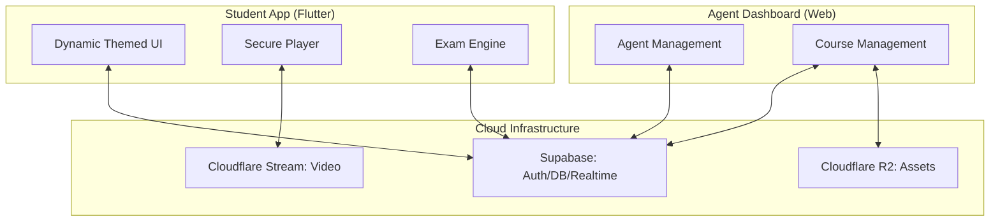
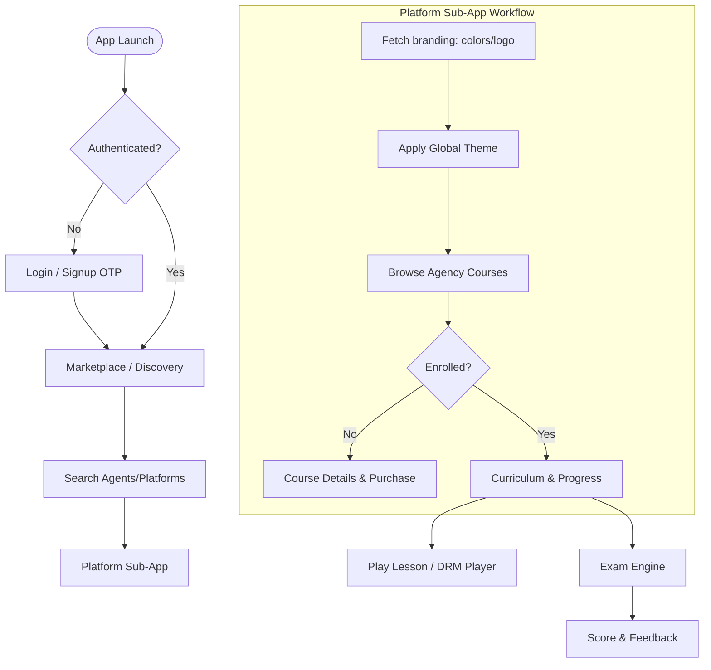

# Aurado Student Native App: Master Plan & Roadmap

The **Aurado Student Native App** is designed as a high-performance "Super App" aggregator. It provides students with a unified experience to access courses, exams, and live classes from multiple EdTech platforms (Agents) while maintaining unique branding for each.

## 🛠 Technology Stack

### Core
- **Framework**: **Flutter** (Recommended for superior performance and consistent look-and-feel across iOS/Android) or **React Native**. 
  - *Recommendation*: **Flutter** – Its custom rendering engine is ideal for the "Dynamic Theming" required for the aggregator model.
- **Language**: Dart (for Flutter) or TypeScript (for React Native).
- **Backend / DB**: **Supabase** (PostgreSQL, Realtime, Auth, Storage).
- **State Management**: BLoC/Provider (Flutter) or Redux/Zustand (React Native).

### Specialized
- **Video Player**: Custom integration with **Cloudflare Stream SDK** for secure, low-latency playback.
- **DRM & Security**: Native platform security flags to prevent screen recording and screenshotting.
- **Deep Linking**: Firebase Dynamic Links or Branch.io to handle course-specific share links.

---

## 📊 System Architecture & App Flow

### High-Level Architecture

### Detailed Student User Flow

---

## 🔗 Connection Architecture

The app connects directly to the **Supabase** backend using the `supabase-flutter` or `supabase-js` library.

1. **Auth Central**: Shared authentication state between the Agent Dashboard and the Native App.
2. **Tenant Resolution**: When a student enters a "Platform" (Agent's space), the app fetches branding data (colors, logo) from the `branding` table.
3. **Dynamic API Bridge**:
   - `GET /courses?tenant_id=...`: Lists courses for a specific platform.
   - `REALTIME`: Notifies students of live classes or exam starts instantly.

---

## 🚀 4-Phase Development Roadmap

### Phase 1: The Core Foundation (Authentication & Discovery)
- **Unified Login**: Secure OTP/Email login synchronized with the main ecosystem.
- **Platform Marketplace**: A beautiful landing page where students can search and discovery EdTech "Agents".
- **Student Profile**: Management of personal info, enrolled courses, and payment history.

### Phase 2: The Learning Hub (Content Delivery)
- **Branded Player Experience**:
  - Dynamic UI that changes colors/logos based on the active course's Agent.
  - Video playback with speed control, resolution switching, and offline support.
- **Curriculum Navigation**: Intuitive subject/chapter/lesson navigation optimized for mobile.
- **PDF & Resource Viewer**: Integrated viewer for course materials.

### Phase 3: Interactive Services (Exams & Growth)
- **Mobile Exam Engine**:
  - Smooth MCQ interface with timers.
  - CQ (Creative Question) support with file upload (photo of handwritten papers).
- **Push Notifications**: Real-time alerts for scheduled classes, exams, and community updates.
- **Gamification**: Badges, streaks, and leaderboards to keep students engaged.

### Phase 4: Anti-Piracy & Polish
- **Full DRM Integration**: Preventing unauthorized sharing and recording.
- **Dynamic Watermarking**: Overlaying student-specific identifying info on videos.
- **App Store/Play Store Ready**: Final performance optimization and deployment.

---

## 🛡 Key Features Matrix

| Feature | Student Value | Agent Value |
| :--- | :--- | :--- |
| **Aggregator Model** | All courses in one app | Instant reach to thousands of students |
| **Dynamic Branding** | Immersive learning | High brand identity & authority |
| **Secure Player** | High-quality streaming | 100% Protection from piracy |
| **Advanced Exams** | Better self-assessment | Automated grading & analytics |
| **Direct Bridge** | No technical headache | Fully managed infrastructure |

---

## Verification Plan
... (as defined in previous implementation_plan.md)
